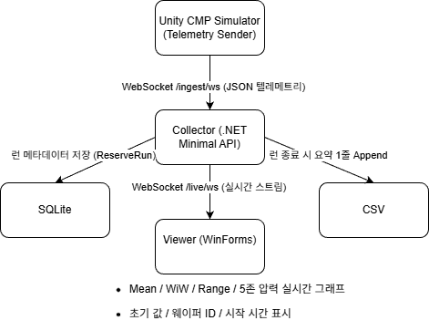

# CMP Telemetry Collector & Viewer

## 개요

Unity로 만든 CMP 시뮬레이터에서 전송하는 텔레메트리(JSON)를 수집하고, 런별 요약(CSV/SQLite)과 실시간 그래프를 제공하는 Collector + Viewer입니다.

모델 구조와 코드 작성에는 GitHub, 공식 문서, ChatGPT의 도움을 받았으며,

전체 파이프라인 설계와 기능 통합, 튜닝, 디버깅은 직접 수행했습니다.

- Collector: .NET 6 Minimal API

- Viewer: WinForms + Chart 컨트롤

## 구조도

## 프로젝트 구성

- Cmp.Collector/ : 텔레메트리 수신, 런 요약 집계, CSV/SQLite 기록

- Cmp.Viewer.Win/ : Collector의 /live/ws WebSocket을 구독해 실시간 그래프 표시

## 스크린샷

좌측 : CMP Simulator로 실시간으로 웨이퍼의 두께를 3D맵으로 시각화 & 실시간 스펙체크

우측 : CMP Viewer로 콜렉터를 통해 받은 실시간 데이터를 그래프로 시각화

  웨이퍼의 초기값은 하단에 표시
